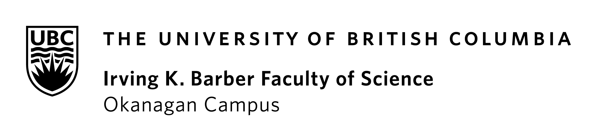

<!--  -->

# Course Syllabus

<!-- Below is the official Langara-mandated Course Syllabus for {{ COURSE_CODE }}.
Elements of this document are **fixed** and unchanging. -->
<!-- Additional details about the course are available on the {{ '[course website]({link})'.format(link=CANVAS_LINK.replace('CANVAS_ID',CANVAS_ID))}}. -->

**{{ COURSE_CODE }} {{ SECTION }}**

**{{ TITLE }} ({{ CREDITS }})**

**{{ TERM }}**

<!-- **{{ MEETING_TIMES }}** -->

**Mode of Delivery**  
- Online

**Location**  
<!-- - Abbotsford, building D
    - AB2 (Tuesdays) - Room 204
    - AB3 (Wednesdays) - Room 242 -->

- Zoom - Link: [https://bit.ly/CIS-145-Zoom-Fall-2023](https://bit.ly/CIS-145-Zoom-Fall-2023)

<!-- **Slack Invitation Link:** [Sign up for CIS 145 Slack Workspace](https://join.slack.com/t/cis-145-summer-2023/shared_invite/zt-1umoip7kj-u_q1OXCTZoPGmgSoI3ifUA) -->

---
## Course Instructor

**Name:** {{ INSTRUCTOR }}

**Email:** parsa.rajabi `[at]` ufv.ca (replace `[at]` with `@`)

Note: When emailing, please put CIS 145 at the start of your subject line.

**Slack:** @parsa

<!-- **Office Hours:** TBA -->
**Office Hours:** Wednesdays 6:00-7:00pm via Zoom - [Book a session](https://calendly.com/prajabi/cis-145-office-hours) beforehand. Failure to not make a booking or arriving late will result in the session being cancelled.
<!-- **Office Hours:** Tuesdays 11:45-12:45pm in Building C, Room 2402 -->

## Course Assistant

**Name:** Gurpreet

**Email:** gurpreetsingh22 `[at]` student.ufv.ca (replace `[at]` with `@`)

Note: When emailing, please put CIS 145 at the start of your subject line.

<!-- **Slack:** @Navneet Jhangra -->

<!-- **Name:** Navneet Jhangra

**Email:** navneet.jhangra `[at]` student.ufv.ca (replace `[at]` with `@`)

Note: When emailing, please put CIS 145 at the start of your subject line.

**Slack:** @Navneet Jhangra -->

<!-- Tuesdays 4-5pm in Building C, Room 2402 -->

<!-- 12:30 - 13:30pm on Saturdays - [Book a session](https://calendly.com/parsa-rajabi/cpsc-2350-office-hour) beforehand  -->

<!-- **Phone:** {{ PHONE }} -->

<!-- **Mode of Delivery:** Online (All course activities and assessments, including the Final Exam, will be conducted Online.) -->

## Course Description

```{include} syllabus_bits/calendar_entry.md
```

## Important Dates

You will find all the important term dates in the [UFV Academic Calendar](https://www.ufv.ca/calendar/current/).

## Learning Outcomes

The Learning Outcomes for this course are:

```{include} syllabus_bits/course_LOs.md
```

More details about the course can be found on [CIS 145 - UFV Academic Calendar](https://www.ufv.ca/calendar/current/)

## Required Materials

Web Development and Design Foundations with HTML5 - 10th edition
by Terry Felke-Morris

Publisher: Pearson
ISBN: 9780135919941

[Link](https://www.pearson.com/en-us/subject-catalog/p/web-development-and-design-foundations-with-html5/P200000003268/9780136662402)

## Course Evaluation

```{include} syllabus_bits/grading_practices_detailed.md
```


<!-- ## Passing Criteria

```{include} syllabus_bits/passing_requirement.md
``` -->

## Late Policy and Missed Assignments/Exams

All course elements (including but limited to) assignments, quizzes, weekly activities and exams are required to be submitted or completed by the specified due dates. Inability to adhere to these deadlines will lead to a score of zero, unless exceptional situations are considered on an individual basis, subject to the approval of the instructor and supported by legitimate documentation.

<!-- ```{include} syllabus_bits/policies.md
``` -->

## Academic Integrity

Academic Integrity is important to me and I know it is to most students. Cheating is never worth the risk to your personal and professional reputation. I expect students to be truthful and honest in their work. This means that any work you submit for individual evaluation should be yours alone and that you recognize the work of others if you use their ideas, thoughts or material. The assignments have been designed to ensure that you learn the material. I ensure that all students are graded fairly and will take action against students who violate the academic dishonesty policy. Students who engage in any acts of falsification, misrepresentation, or deception will face penalties for violating UFV policy, which can include failure in the assignment and/or a FD-Failed for Discipline grade on your transcript. Listed below are some examples of academic dishonest behavior that will result in a grade penalty:

### Plagiarism

This refers to passing off the work of another as your own. Make sure to cite all your sources if you incorporate the words or ideas of another person. This includes sources from books, journals, the internet, emails, live presentations (e.g. speeches) and even relevant conversations with other people. You can avoid plagiarism by appropriate citation and referencing in your papers, projects and presentations.

### Inappropriate use of technology in coursework

The use of technology to produce content for your assignments that is not specifically listed in the syllabus as permissible is strictly prohibited. All submissions for grading must be your own work. This specifically includes a prohibition on artificial intelligence writing software such as ChatGPT and translation software as it will interfere with the learning objectives outlined for this course.

### Collusion/ Unauthorized Collaboration

You are expected to complete all assignments for this course on your own. When assigned individual work, it is unfair to collaborate and gain an unfair advantage over your classmates who complete their work on their own. Collusion includes sharing homework, quiz or test questions and answers with other students. Examples of collusion:

- Working on answers with a friend for a homework assignment or during an open book exam
- Using “tutoring websites” (e.g. Chegg.com, CourseHero) to find answers to assignment/ exam questions
- Assisting others to cheat by answering questions that are posted to a FB/ WhatsApp group
- Falsifying/ fabricating information

**Do not misrepresent yourself or your work.** The following are examples of prohibited behavior:

- Making up sources or facts
- Misrepresenting your identity by asking someone else to complete any portion of a course (i.e. make comment on a discussion board, i-clicker quiz, exam)
- Falsifying or altering any documentation required by the University, including (but not limited to) doctors note’s in order to gain an academic advantage
 
### Unauthorized use of note-sharing websites

You may come across websites that claim to help students by providing answers to test questions and encourage students to upload your instructor’s copyrighted material (e.g. lecture slides, exam questions, etc.) Sharing exam/assignment questions is strictly prohibited as this material is the intellectual property of the instructor and should not be shared in any format. Furthermore, beware of uploading your own completed assignments/essays as you could be assisting other students to cheat using your material. Assisting others to cheat is strictly prohibited in the UFV student academic integrity policy.

Note sharing sites expect their users to comply with the Honour Code of their organization. Their own policy mandates that they cooperate with an investigation of academic dishonesty. The UFV Academic Integrity Office routinely monitors these sites for evidence of cheating and will initiate discipline proceedings against students who violate the UFV Student Academic Integrity policy.

### Unauthorized use of tutors/ editors

If you plan to use a tutor/editor, be aware that any work that you submit must always be your own. An ethical tutor will always focus on explaining concepts so that you can become an independent learner. You are violating the student academic integrity policy if:

- a private tutoring company coaches you on how to complete an assignment
- you buy / sell/  swap assignment questions and answers on social media platforms like WeChat, Whatsapp, Facebook, etc.
- your use an editor (paid or unpaid) without permission of the instructor to revise, correct or alter your work