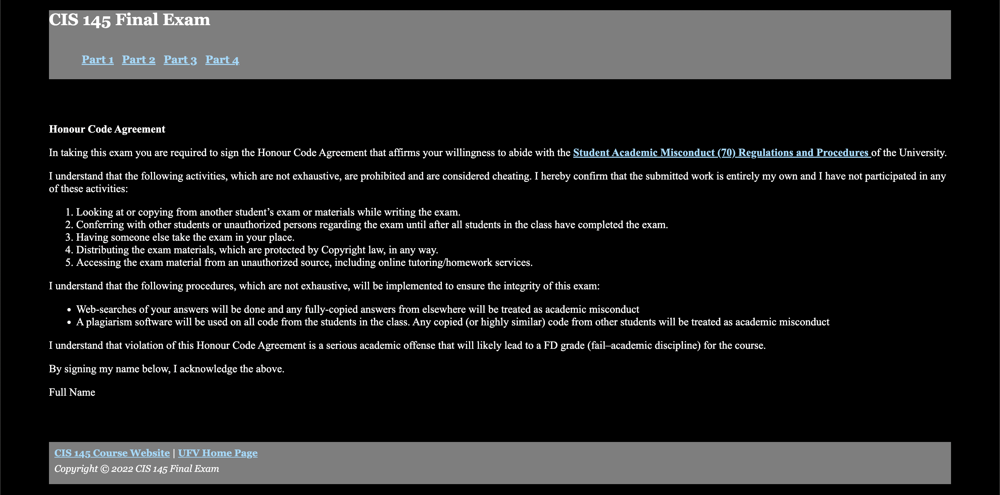
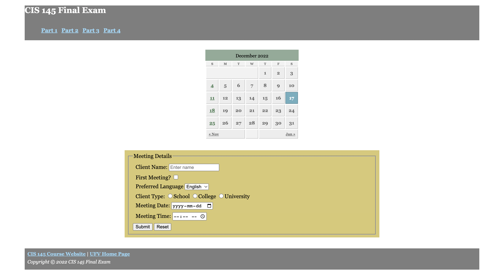
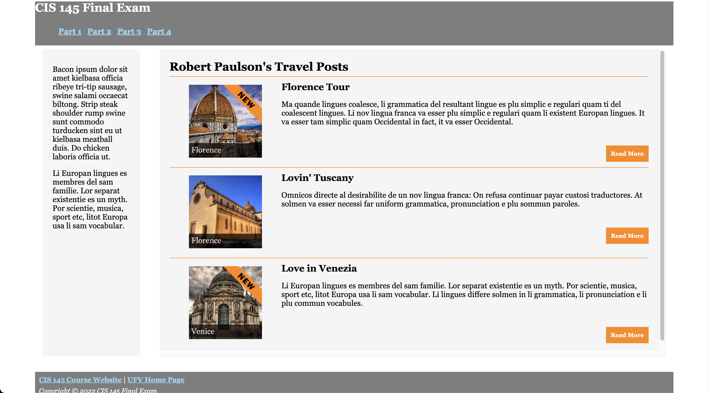

# Final Exam - Dec 17, 2022

## Typo Corrections
Here is a list of typos that have been corrected on th exam since the exam was released. 

1. Part 2 > #4 > section b > padding > should be `0.25em` NOT `25em`. 
2. Part 2 > #4 > section c > padding > should be `0.25em` NOT `25em`. 

## Donwload starter code
- Copy/download the starter code for Part 4 from here: [part4.html](https://github.com/Parsa-Rajabi/cis-145/blob/main/final/part4.html)
- Copy/download the images for Part 4 from here: [images](https://github.com/Parsa-Rajabi/cis-145/tree/main/final/images)

## Donwload screenshots

Follow the instructions below if you'd like to download the images below to your computer:
1. Go to the image you'd like to download
2. Right click on the image
3. Click on "Save As"
4. Save file on local computer (make sure the file name is `partX.png` where X is the part number. i.e. `part1.png` )

## Part 1 

## Part 2 

## Part 3

## Part 4 (clean)

## Part 4 (specifications)

## Part 4 Images

