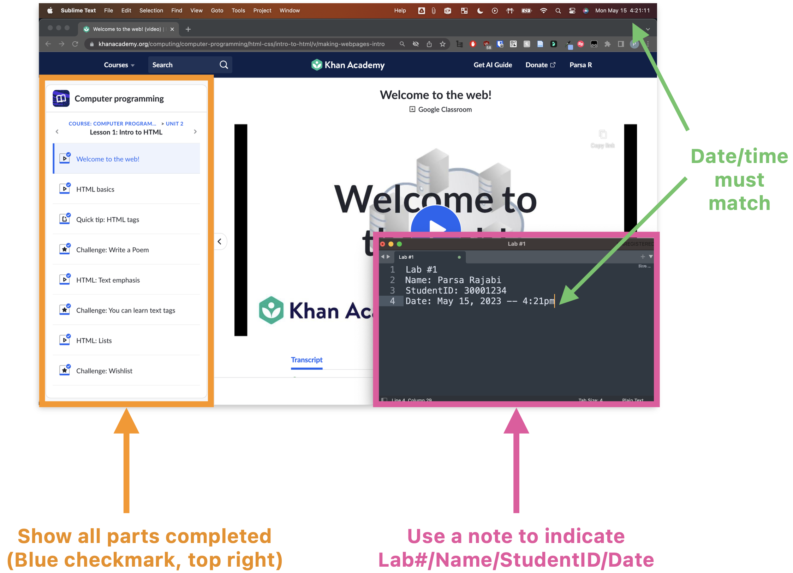
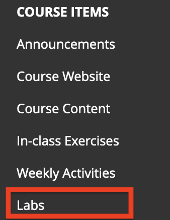
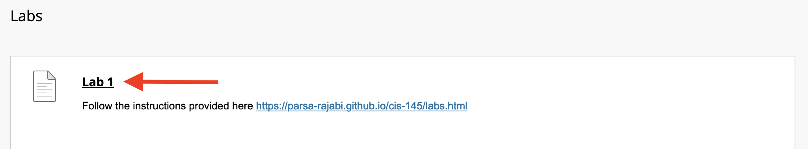

# Labs

```{tip}
All course elements (inlcuding but limited to) assignments, quizzes, weekly activities and exams are required to be submitted or completed by the specified due dates. Inability to adhere to these deadlines will lead to a score of zero, unless exceptional situations are considered on an individual basis, subject to the approval of the instructor and supported by legitimate documentation.
```

## About

- Labs are intended as exercise for you to learn new concepts and get hands on experience to practice the course material
- All labs will be assigned and graded via Khan Academy

## Join Khan Academy

- Join the CIS 145 Khan Academy's classroom using [this link](https://www.khanacademy.org/join/CVWBVPAR)
- If you get prompted, enter `CVWBVPAR` as the class code to join CIS 145 Spring 2024
**- You must use your `@student.ufv.ca` email account to sign up**

## Schedule 

- Refer to assigned items on Khan Academy and their specific due date

## Submission Process

- Labs should be completed via Khan Academy's website and a screenshot of all completed work should be submitted to Blackboard
- The screenshot of completed work should include:
    - Your completed lab
        - Make sure all the tasks on the left hand side have a checkmark on the top-right, indicating that they're complete
        - You can break down the tasks into chunks and submit multiple screenshots 
    - A note 
        - Lab #
        - Your Name
        - Your Student ID
        - Current Date/Time (this must match your system's date/time)

```{attention} 
Screenshot submissions without a note that includes the information above will recieve a 50% mark deduction. Failure to submit a screenshot to Blackboard will result in a mark of zero. No exceptions.
```
### Example Screenshot

Here is an example of how your screenshot(s) should look like. Make sure to include the all information required in the note and include the computer's date/time in the screenshot.

```{tip}
Here's how to capture a screenshot on [Windows](https://www.wikihow.com/Take-a-Screenshot-in-Microsoft-Windows) and [Mac](https://support.apple.com/en-ca/HT201361)
```


### Blackboard Submission

Here are the steps to submit your screenshot to Blackboard:

1. Go to myclasses/blackboard UFV
2. Navigate to CIS 145 Course
3. On the sidebar, select `Labs`



4. Find the respective lab



5. Submit your screenshot before the deadline