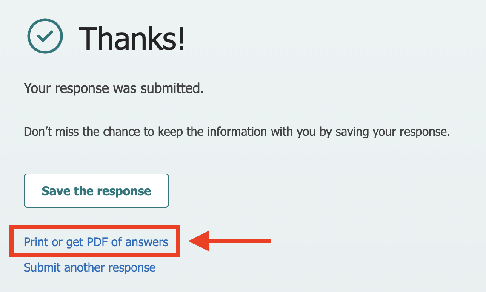
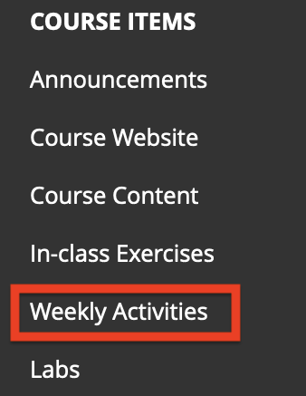
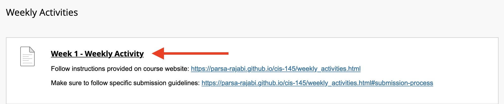

# Weekly Activites

```{warning}
Login with your UFV email address to access the MS Forms
```

```{tip}
All course elements (inlcuding but limited to) assignments, quizzes, weekly activities and exams are required to be submitted or completed by the specified due dates. Inability to adhere to these deadlines will lead to a score of zero, unless exceptional situations are considered on an individual basis, subject to the approval of the instructor and supported by legitimate documentation.
```

## About
Weekly activities are intended as exercises for you to review the lecture content and keep up with the material on a regular basis. 

As part of your weekly activities you will go over the topic that we covered in class and write 4 questions with answers. Some of your questions could appear on your exam(s).

You will create 4 questions/answers total for each lecture, 1 of each type:

1. True/False
2. Multiple Choice (4 options)
3. Short Answer (Answer should be 1-3 sentences)
4. Long Answer (Answer should be 4-8 sentences)

`Note: For T/F and MC questions, you will be required to provide the answer and an explanation as to why that is the answer.`

You will be graded on both completion and quality of your questions:

- Each week, this portion of your weekly activity will be marked out of 5 marks
    - [0.5 for question, 0.5 for answer/explanation + reference] per question type x4 = [4 marks]
    - [0.25 mark] for each question quality x4 = [1 mark]

```{warning}
Forms open at 10pm after lecture and are due at 6pm before the following lecture.
```

## Schedule 
| **Week #** | **Due Date (6:00 pm PST)** |                    **Link**                     |
| :--------: | :------------------------: | :---------------------------------------------: |
|     0      |          Sept 13           | [Week 0](https://forms.office.com/r/cu637Gk91M) |
|     1      |          Sept 13           | [Week 1](https://forms.office.com/r/NMm4KpUywX) |
|     2      |          Sept 20           | [Week 2](https://forms.office.com/r/V9qSg2D4Kd) |
|     3      |          Sept 27           | [Week 3](https://forms.office.com/r/90rD9UG2ia) |
|     4      |             -              |                        -                        |
|     5      |           Oct 11           | [Week 5](https://forms.office.com/r/hccvcAMzik) |
|     6      |           Oct 18           | [Week 6](https://forms.office.com/r/PSBPZQCFjk) |
|     7      |             -              |                        -                        |
|     8      |           Nov 1            | [Week 8](https://forms.office.com/r/KtGdbswwjA) |
|     9      |           Nov 8            | [Week 9](https://forms.office.com/r/92QDKEBu4N) |
|     10     |             -              |                        -                        |
|     11     |             -              |                        -                        |
|     12     |           Nov 29            | [Week 12](https://forms.office.com/r/6q2KVLVi9n) |
|     13     |           Dec 6            | [Week 13](https://forms.office.com/r/L5JDeVyNHH) |
|     14     |           Dec 11           | [Week 14](https://forms.office.com/r/5BfT0zXAPb) |


<!-- | **Week #** | **Due Date (11:00 am PST)** | **Link** |
|:------:|:----------------------:|:------:|
|    1   |            May 23      | [Week 1](https://forms.office.com/r/SpHqvqr1vu) |
|    2   |            May 23      | [Week 2](https://forms.office.com/r/Mu3FHEW1dV) |
|    3   |            May 30      | [Week 3](https://forms.office.com/r/nDtT4AmpDs) |
|    4   |            Quiz #1     | -          |
|    5   |            June 13     | [Week 5](https://forms.office.com/r/vgnjk5RqaW) |
|    6   |            June 20     | [Week 6](https://forms.office.com/r/ZpfiFvFCYa) |
|    7   |            Quiz #2     | -          |
|    6   |            July 4      | [Week 8](https://forms.office.com/r/56bQD9t4rY) |
|    9   |            July 11     | [Week 9](https://forms.office.com/r/f7wS51vSTY) |
|    10  |            Quiz #3     | -          |
|    11  |            Cancelled     | - |
|    12  |            Aug 1       | [Week 12](https://forms.office.com/r/NpU6rEfALK)|
|    13  |            Aug 8       | [Week 13](https://forms.office.com/r/28Wd6wd86v)| -->


```{attention} 
Each weekly activity's form and blackboard submissions will close promptly at the specified deadline
```

<!-- | Week # | Due Date (11:00 am PST) | Link |
|:------:|:----------------------:|:------:|
|    2   |            May 23      | [Week 2]() |
|    3   |            May 30      | [Week 3]() |
|    4   |            June 6      | [Week 4]() |
|    5   |            June 13     | [Week 5]() |
|    6   |            June 20     | [Week 6]() |
|    7   |            June 27     | [Week 7]() |
|    6   |            July 4      | [Week 8]() |
|    9   |            July 11     | [Week 9]() |
|    10  |            July 18     | [Week 10]() |
|    11  |            July 25     | [Week 11]() |
|    12  |            Aug 1       | [Week 12]() | -->

<!-- | Week # | Due Date (11:59pm PST) | Link |
|:------:|:----------------------:|:------:|
|    1   |            Jan 11      | [Week 1](https://forms.office.com/r/UceMThtCmq) |
|    2   |            Jan 18      | [Week 2](https://forms.office.com/r/fYsU1jFWC3) |
|    3   |            Jan 25      | [Week 3](https://forms.office.com/r/E7Ydd8aF8y) |
|    4   |            Feb 1       | [Week 4](https://forms.office.com/r/PZk6B5FUWT) |
|    5   |            Feb 8       | [Week 5](https://forms.office.com/r/KSwf8NRrJa) |
|    6   |            Feb 15      | [Week 6](https://forms.office.com/r/jeEtzTj3m2) |
|    7   |            Midterm                  |                    -                |
|    8   |            Reading Break            |                     -               |
|    9   |            March 8     | [Week 9](https://forms.office.com/r/iDs3kKkT3D) |
|    10  |            March 15    | [Week 10](https://forms.office.com/r/s3Lnmj90j7) |
|    11  |            Co-working Session    | - |
|    12  |            March 29    | [Week 12](https://forms.office.com/r/KsuGeGJQ3e) |
|    13  |            April 5     | [Week 13](https://forms.office.com/r/BRhCjBG6AH) |
|    14  |            April 12    | [Week 14](https://forms.office.com/r/w6hkNETf1t) | -->

## Submission Process

- Weekly activities will be submitted via MS Forms and a confirmation of submission needs to be submitted to Blackboard.
- At the bottom of the MS Form, make sure to select the following checkmark BEFORE pressing the submit button.
    - `Send me an email receipt of my responses`


- Once you receive the email receipt of your reponses via email, select "view my responses" and save the page as a PDF submit it to Blackboard.

```{tip}
Not sure how to save the page as PDF? [Read this guide on how to do so](https://www.consumerfinance.gov/consumer-tools/save-as-pdf-instructions/).
```

- Alternatively, once you press submit, you can download your responses as PDF on the confirmation page. Refer to the screenshot below for details



```{attention} 
Failure to submit the PDF receipt of the responses to Blackboard will be result in a -1 penalty. 
```

### Blackboard Submission

Here are the steps to submit your weekly activity receipt to Blackboard:

1. Go to myclasses/blackboard UFV
2. Navigate to CIS 145 Course
3. On the sidebar, select `Weekly Activities`



4. Find the respective weekly activity 



5. Submit your receipt before the deadline